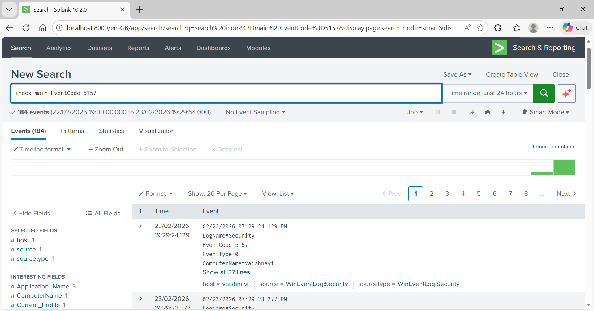
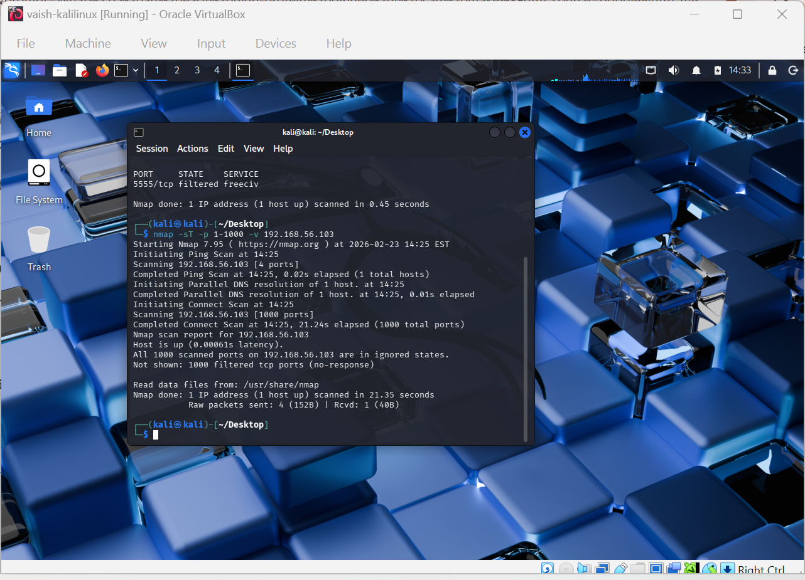
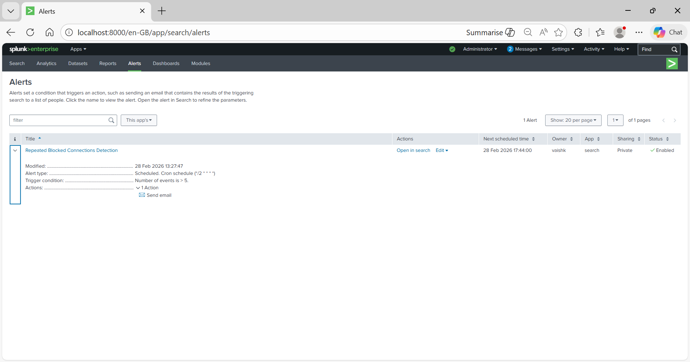
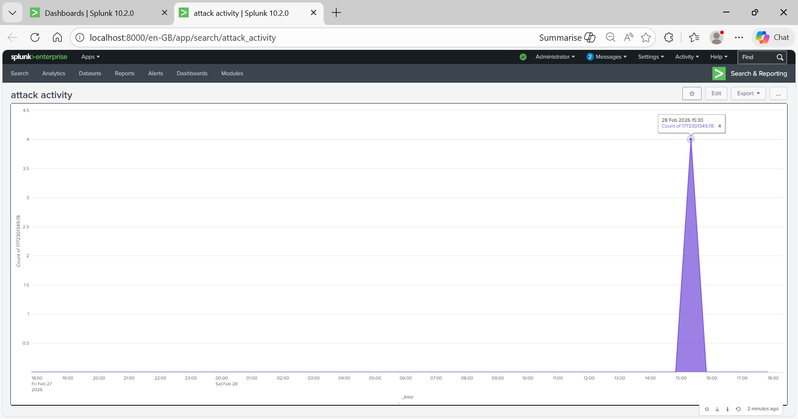
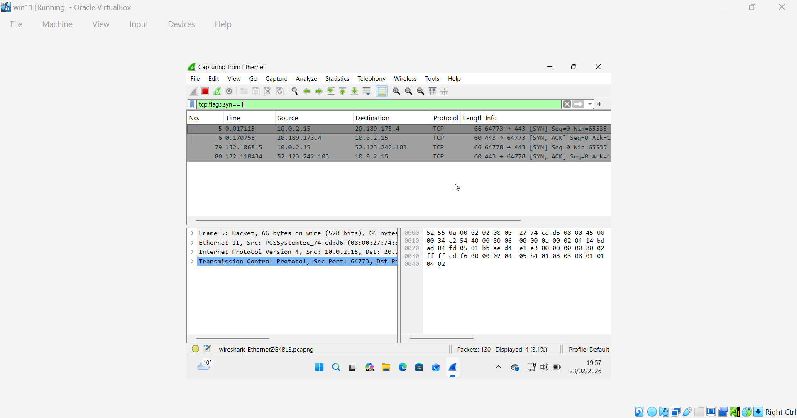
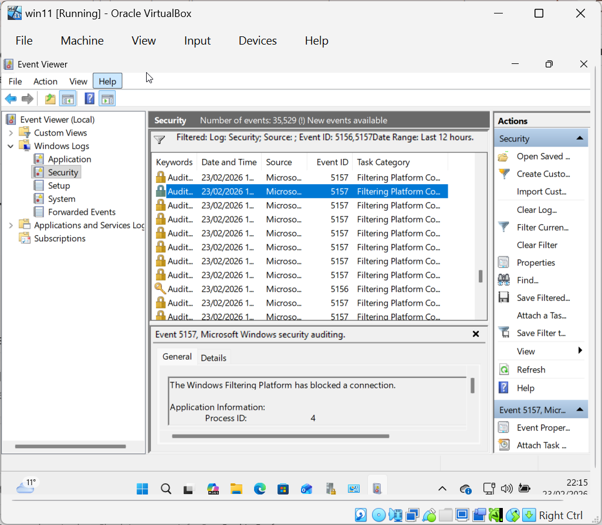
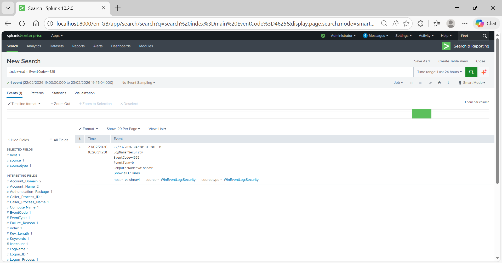

# 1. Lab Environment Setup

## Components Used

- Windows Virtual Machine (Target System)
- Kali Linux Virtual Machine (Attacker System)
- Splunk Enterprise (Installed on Host Laptop)
- Splunk Universal Forwarder (Installed on Windows VM)
- Wireshark (Installed on Windows VM)

## Network Setup

- Kali Linux IP: 10.0.2.15
- Windows VM IP: 192.168.56.103
- Splunk Receiving Port: 9997

The Splunk Universal Forwarder was configured to forward Windows Event Logs to Splunk Enterprise using port 9997.

---

# 2. Log Ingestion Verification in Splunk

After configuring the Universal Forwarder, Splunk was checked to verify log ingestion.

Search used:

index=main

To specifically check firewall events:

index=main EventCode=5156 OR EventCode=5157

This screenshot shows Windows Firewall events successfully ingested into Splunk.

---

# 3. Simulating a Port Scan Attack

From Kali Linux, a TCP Connect scan was performed against the Windows target machine:

nmap -sT -p 1-1000 192.168.56.103

Even though all ports appeared filtered, the scan generated firewall logs.

This screenshot shows the Nmap scan generating attack traffic toward the Windows VM.

---

# 4. Analyzing Firewall Events in Splunk

To detect the simulated attack, the following Splunk query was used:

index=main EventCode=5156 OR EventCode=5157

Observed Event Codes:

- 5156 → Allowed Connection
- 5157 → Blocked Connection

This screenshot confirms detection of port scan activity in Splunk.

---

# 5. Creating a Detection Alert in Splunk

An alert was configured in Splunk to detect repeated blocked connections.

Alert Conditions:
- Search: EventCode=5157
- Trigger if more than 5 events occur within 2 minutes
- Action: Trigger alert inside Splunk

This screenshot shows the alert configuration for port scan detection.

---

# 6. Creating a Splunk Dashboard

To visualize attack activity, a dashboard was created using the following search:

index=main EventCode=5156 OR EventCode=5157 | stats count by src_ip

This generates a count of connection attempts by source IP address.

This screenshot shows visualization of attacker activity.

---

# 7. Capturing Network Traffic Using Wireshark

Wireshark was used to capture live network traffic during the Nmap scan.

Filter used to detect TCP SYN packets:

tcp.flags.syn==1

This screenshot shows TCP SYN packets sent from the Kali attacker machine.

---

# 8. Verifying Raw Firewall Logs

The Windows firewall raw log file was examined:

C:\Windows\System32\LogFiles\Firewall\pfirewall.log

This confirms that Windows Firewall logs blocked and allowed traffic at the system level.

---

# 9. Simulating Failed Login Attempts (Optional)

Multiple incorrect login attempts were performed on the Windows VM.

Splunk search used:

index=main EventCode=4625

Event Code Observed:
- 4625 → Failed Login Attempt

This screenshot shows detection of failed authentication attempts in Splunk.

---

# 10. Conclusion

This Detection Lab successfully demonstrated:

- Configuration of Splunk Enterprise and Universal Forwarder
- Log ingestion and analysis in SIEM
- Simulation of network attacks using Nmap
- Detection of firewall events (5156, 5157)
- Detection of failed login attempts (4625)
- Alert configuration in Splunk
- Traffic capture and analysis using Wireshark
- Visualization of attack telemetry using dashboards

All activities were performed in a controlled lab environment for educational purposes.

This project demonstrates practical understanding of:
- SIEM log analysis
- Network attack detection
- Windows firewall logging
- Security monitoring and alerting
